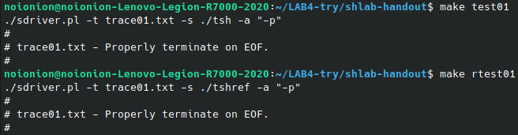
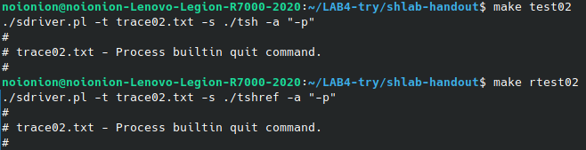
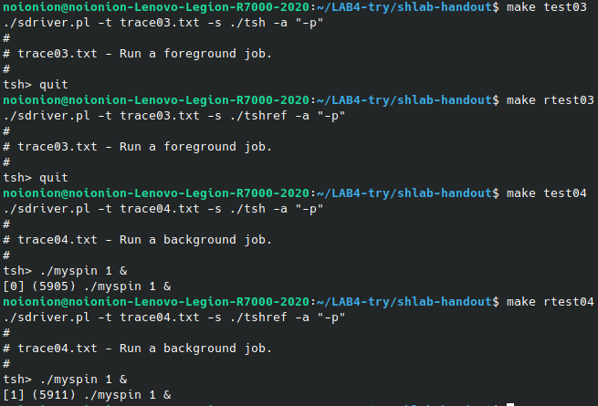
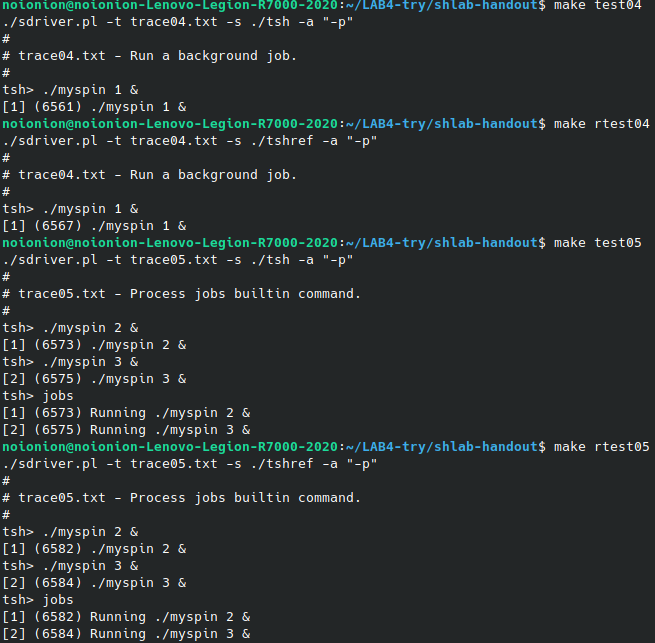
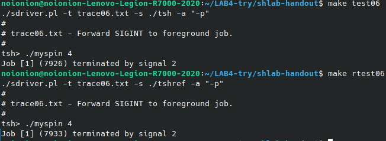
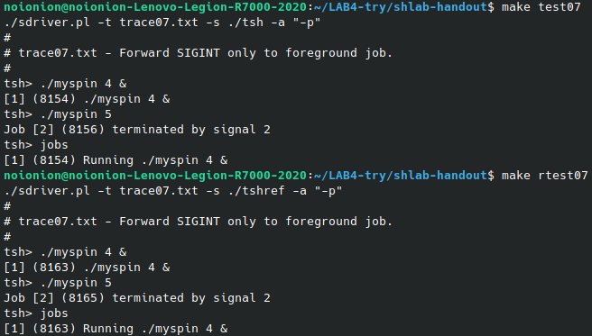

# CSAPP shell Lab（系统外壳实验）

## 前提

1、实验目的：

总的来说就是让我们补充位于`tsh.c`中的七个函数，从而实现一个支持任务功能的`shell`。

因此在这儿将这七个函数分为两部分：

(1) 实现完成内置命令（`jobs`, `fg`, `bg`, `kill`）的四个函数：

```c
/*
quit：命令终止tsh进程
jobs：命令列出所有后台进程
bg：命令会向作业发送SIGCNOT信号来重启job，并作为后台作业运行，参数可以是PID或JID
fg：同上，唯一区别是job以前台作业运行
*/

/*
eval 函数作用：
  命令行进行解析后，调用 builtin_cmd 函数
  builtin_cmd 函数就会检查第一个命令行参数是否为内置命令，是则返回 1 ，否则返回 0
*/
void eval(char *cmdline);
/*
builtin_cmd 函数作用
  执行四个内置命令
*/
int builtin_cmd(char **argv);
/*
do_bgfg 函数作用
  处理 fg 和 bg 操作
*/
void do_bgfg(char **argv);
/*
waitfg 函数作用
  等待前台进程结束
*/
void waitfg(pid_t pid);
```

(2) 实现三个信号（`SIGCHLD`, `SIGINT`, `SIGTSTP`）的处理函数：

```c
/*
sigint_handler 函数作用
  捕捉 SIGCHLD 信号，唤醒父进程为子进程收尸，避免产生僵尸进程
*/
void sigchld_handler(int sig);
/*
sigtstp_handler 函数作用
  捕捉 SIGTSTP(^z) 信号，将此信号发给前台进程组
*/
void sigtstp_handler(int sig);
/*
sigint_handler 函数作用
  捕捉 SIGINT(^c) 信号，将此信号发给前台进程组
*/
void sigint_handler(int sig);
```

再来了解一下需要用到的辅助函数：

```c
int parseline(const char *cmdline, char **argv);                                // 解析命令行并构建 argv 数组
void sigquit_handler(int sig);                                                  //

void clearjob(struct job_t *job);                                               // 清除 job 结构中的条目
void initjobs(struct job_t *jobs);                                              // 初始化作业列表
int maxjid(struct job_t *jobs);                                                 // 返回已分配的最大作业id
int addjob(struct job_t *jobs, pid_t pid, int state, char *cmdline);            // 新增向 job 列表中添加job
int deletejob(struct job_t *jobs, pid_t pid);                                   // 从 job 列表中删除 PID = pid 的作业
pid_t fgpid(struct job_t *jobs);                                                // 返回当前前台 job 的 PID，如果没有该 job 则返回 0
struct job_t *getjobpid(struct job_t *jobs, pid_t pid);                         // 从 job 列表中通过 PID 找到一个 job
struct job_t *getjobjid(struct job_t *jobs, int jid);                           // 从 job 列表中通过 JID 找到一个 job
int pid2jid(pid_t pid);                                                         // 将 PID 映射到 JID
void listjobs(struct job_t *jobs);                                              // 打印 job 列表

void usage(void);                                                               // 打印帮助信息
void unix_error(char *msg);                                                     // unix-style 错误程序
void app_error(char *msg);                                                      // application-style 错误程序
typedef void handler_t(int);                                                    //
handler_t *Signal(int signum, handler_t *handler);                              // sigaction 函数包装器
```

2. 实验资源

`trace01.txt` - `trace16.txt` 为测试用的样例。我们也将由此来补全7个函数。

3. 如何测试

首先编写完`tsh.c`文件后，使用`make`命令进行构建。然后再使用`make testxx`和`make rtestxx`（注：`xx`指样例编号）进行比对。

`make rtestxx`将使用原作者编写的`tshref`文件进行测试，而`make testxx`则将使用我们编写的`tsh`进行测试。

若两者测试结果除`PID`以外均相同，则说明代码正确。另外`trace11`-`trace13`的`ps`输出可能次次不同，但重点是使进程状态相同。

## 实验过程

我们将以样例的推进来逐步补全7个函数。

### trace01

> trace01.txt – 在 EOF 处正确地停止。

`eval`函数是根据输入命令行进行对应操作的函数。在`CSAPP 2e 8.4.6 节（中文版 P502 / 英文版 P733）`，有`eval`函数的大致框架。

```c
void eval(char *cmdline)
{
    char *argv[MAXARGS];                                                        // 参数列表
    char buf[MAXLINE];                                                          // 保存修改的命令行
    int bg;                                                                     // 用于记录是否为后台进程
    pid_t pid;                                                                  // 进程pid

    strcpy(buf, cmdline);
    bg = parseline(buf, argv);                                                  // 提取参数列表
    if (argv[0] == NULL)                                                        // 忽略空命令
    {
        return;
    }

    if (!builtin_cmd(argv))                                                     // 判断是否为内置命令
    {
        if ((pid = fork()) == 0)                                                // 子程序运行用户作业
        {
            if (execve(argv[0], argv, environ) < 0)                             // 若无法查到路径下可执行文件，则报错并退出
            {
                printf("%s: Command not found\n", argv[0]);
                exit(0); // here only child exited
            }
        }
        if (!bg)                                                                // 如果不是后台进程
        {
            int status;
            if (waitpid(pid, &status, 0) < 0)                                   // 等待前台进程
            {
                unix_error("waitfg: waitpid error");
            }
        }
        else                                                                    // 如果前台则立即执行
        {
            printf("[%d] (%d) %s", pid2jid(pid), pid, cmdline);
        }
    }
    return;
}
```

在`trace01`测试中，我们只需要正确响应`EOF`就可以了。此时这份框架不做修改就已经可以直接使用并通过第一个测试。



### trace02

> trace02.txt – 处理内置的 quit 命令。

在`tsh`中，内置的命令实在`builtin_cmd`函数中处理的。只需要在其中判断一下第一个参数是否为`quit`，如果是的话退出即可。

```c
int builtin_cmd(char **argv)
{
    if (strcmp(argv[0], "quit") == 0)                                           // 判断是否为 quit
        exit(0);

    return 0;
}
```

`trace02`测试下，此时我们已经能正确相应`quit`内置指令了。



### trace03 && trace04

> trace03.txt – 运行一个前台任务。
>
> trace04.txt – 运行一个后台任务。

在课本的`eval`框架中，首先使用`builtin_cmd`判断并处理内置函数，然后根据`bg`值（由`parseline`得到）判断是否在后台运行。这其中会先`fork`出一个子进程，然后使用`execve`执行目标程序。请注意，只有子进程会在运行失败时`exit`。根据是否是前台任务，判断是直接打印执行详情还是等待前台进程结束。

所以依照框架，现在的代码已经能顺利运行`trace03`和`trace04`了。但是有一点小小的问题，`trace04`测试中的`jid`输出有些不同，这会在`trace05`中解决。



### trace05

> trace05.txt – 处理 jobs 内置命令。

`tsh`已经为我们实现了`listjobs`函数，可以直接放到`builtin_cmd`中。注意`return 1`这里是用来告诉`eval`已经找到了一个内置命令，否则会提示`“command not found”`。编辑`builtin_cmd`中处理`jobs`命令的函数段，更改为：

```diff
  // builtin_cmd()

  int builtin_cmd(char **argv)
  {
      if (strcmp(argv[0], "quit") == 0)                                           // 判断是否为 quit
        exit(0);
+     if (strcmp(argv[0], "jobs") == 0)                                           // 判断是否为 jobs
+     {
+         listjobs(jobs);
+         return 1;                                                               // 用来告诉`eval`已经找到了一个内置命令
+     }
      return 0;
  }
```

但是不管怎么样，运行`jobs`都不会输出任何东西。毕竟在我们已有的代码里，既没有在任务开始时将其添加到任务列表，也没有在结束时将它移出。要做到将任务添加到任务列表，需要在`fork`后调用`addjob`，故修改`eval`函数：

```diff
  // eval()

          // ...
              if (execve(argv[0], argv, environ) < 0)                             // 若无法查到路径下可执行文件，则报错并退出
              {
                  printf("%s: Command not found\n", argv[0]);
                  exit(0); // here only child exited
              }
          }
+         addjob(jobs, pid, bg ? BG : FG, cmdline);                               // 添加job到列表中
+         // 第三个参数 state 有三个取值，FG=1、BG=2、ST=3，可以直接使用 bg+1
          if (!bg)                                                                // 如果不是后台进程
          {
              int status;
              if (waitpid(pid, &status, 0) < 0)                                   // 等待前台进程
          // ...
```

至于删除任务的工作，需要在`sigchld_handler`函数中处理。这涉及到对`waitpid`函数的更深入理解，在`CSAPP 8.4.3 节（中文版 P496，英文版 P724）`，提到了这样一段话，介绍了`waitpid`函数的默认行为，以及退出状态的检查方法

> （更改默认行为）WNOHANG|WUNTRACED：立即返回。如果等待集里面没有子进程已经终止，那么返回 0；否则，返回其中一个已终止子进程的 PID。
>
> （检查回收子进程的返回状态）WIFEXITED(status)：如果子进程正常退出，即通过调用 exit 或者 return，则返回真。

Writeup 中也提到`WNOHANG|WUNTRACED`或许会有用。前一个更改默认行为的部分对应了`waitpid`的第三个参数，后一个检查用于确定是否有个子进程真的退出了（而非没有子进程终止，`waitpid`返回了`0`）。有了这些知识，可以得到实现如下，如此便可以将退出的进程从任务列表删除：

```c
void sigchld_handler(int sig)
{
    pid_t pid;
    int status;
    while((pid=waitpid(-1,&status,WNOHANG|WUNTRACED))>0)                        // 如果子进程是僵尸进程，则无需等待
    {
        if(WIFEXITED(status))
        {
            deletejob(jobs,pid);                                                // 删除 job
        }
    }
    return;
}
```

如果当前任务需要在前台运行，需要等待前台任务（如果有）结束，但`tsh`有一个`waitfg`函数，看起来原作者的意思是不想让我们把等待工作放到`eval`中（书本的框架中等待事件在`eval`函数处理）。于是这一部分改成：

```diff
  // eval()

          // ...
          if (!bg)                                                                // 如果不是后台进程
          {
-             int status;
-             if (waitpid(pid, &status, 0) < 0)                                   // 等待前台进程
-             {
-                 unix_error("waitfg: waitpid error");
-             }
+             waitfg(pid);                                                        // 等待前台进程
          }
          else                                                                    // 如果前台则立即执行
          // ...
```

至于`waitpid`函数的实现，Writeup 中已经给了提示：

> 实验有一个棘手的部分，是决定`waitfg`和`sigchld`处理函数之间的工作分配。我们推荐以下方法：
>
> * 在`waitfg`中，用一个死循环包裹`sleep`函数。
>
> * 在`sigchild_handler`中，调用且仅调用一次`waitpid`。

```c
void waitfg(pid_t pid)
{
    while (pid == fgpid(jobs))
    {
        sleep(0);
    }
    return;
}
```

另外还要处理`eval`中的信号问题。Writeup 中提到：

> 在`eval`中，父进程在 fork 子进程之前，必须使用`sigprocmask`函数来阻断`SIGCHLD`信号，然后在使用`addjob`将子进程加入任务列表之后，再调用`sigprocmask`恢复`SIGCHLD`信号。因为子进程继承了父进程的中断向量，所以子进程必须在它执行新程序之前将`SIGCHILD`恢复。

> 父进程这样将`SIGCHLD`信号阻断，是为了避免子进程被`SIGCHLD`处理程序回收（然后被从任务列表中移除），之后父进程调用`addjob`时的竞态条件。

故修改`eval`函数：

```diff
  void eval(char *cmdline)
  {
      char *argv[MAXARGS];                                                        // 参数列表
      char buf[MAXLINE];                                                          // 保存修改的命令行
      int bg;                                                                     // 用于记录是否为后台进程
      pid_t pid;                                                                  // 进程pid
+     sigset_t mask;
+     sigemptyset(&mask);                                                         
+     // 父进程在 fork 子进程之前，必须使用 sigprocmask 函数来阻断 SIGCHLD 信号

      strcpy(buf, cmdline);
      bg = parseline(buf, argv);                                                  // 提取参数列表
      if (argv[0] == NULL)                                                        // 忽略空命令
      {
          return;
      }

      if (!builtin_cmd(argv))                                                     // 判断是否为内置命令
      {
+         sigaddset(&mask, SIGCHLD);
+         sigprocmask(SIG_BLOCK, &mask, NULL);                                    // 判断不是内置命令之后，阻断 SIGCHLD 信号

          if ((pid = fork()) == 0)                                                // 子程序运行用户作业
          {
+             sigprocmask(SIG_UNBLOCK, &mask, NULL);                              // 在子进程 execve 之前，恢复信号
              if (execve(argv[0], argv, environ) < 0)                             // 若无法查到路径下可执行文件，则报错并退出
              {
                  printf("%s: Command not found\n", argv[0]);
                  exit(0); // here only child exited
              }
          }
          addjob(jobs, pid, bg ? BG : FG, cmdline);                               // 添加job到列表中
          // 代码的 addjob 中第三个参数 state 有三个取值，FG=1、BG=2、ST=3。虽然直接使用 bg+1 也是可行的方案，但这样使用三元运算符会更优雅更容易理解。
+         sigprocmask(SIG_UNBLOCK, &mask, NULL);                                  // 父进程 addjob 完毕后也要恢复

          if (!bg)                                                                // 如果不是后台进程
          // wait for foreground job to terminate
          {
              waitfg(pid);                                                        // 等待前台进程
              int status;
              if (waitpid(pid, &status, 0) < 0)                                   // 等待前台进程
              {
                  unix_error("waitfg: waitpid error");
              }
              */
          }
          else                                                                    // 如果前台则立即执行
          {
              printf("[%d] (%d) %s", pid2jid(pid), pid, cmdline);
          }
      }
      return;
  }
```

这样就可以通过`trace05`的测试了



# trace06

> trace06.txt – 将 SIGINT 信号发送到前台任务。

这个`trace`解决起来比较简单。首先，我们需要实现`SIGINT`信号的处理例程。这里使用`-pid`是为了将整个进程组的进程全部干掉。

```c
void sigint_handler(int sig)
{
    pid_t pid = fgpid(jobs);                                                    // 获取前台进程pid
    if (kill(-pid, SIGINT) < 0)                                                 // 尝试将整个进程组终止
    {
        unix_error("sigint error");
    }
    return;
}
```

在`tshref`中，终止进程后还会输出一行提示信息，由于这也算是子进程结束了，这部分也是在`sigchld_handler`中处理的。

```diff
  void sigchld_handler(int sig)
  {
      pid_t pid;
      int status;
      while((pid=waitpid(-1,&status,WNOHANG|WUNTRACED))>0)                        // 如果子进程是僵尸进程，则无需等待
      {
          if(WIFEXITED(status))
          {
              deletejob(jobs,pid);                                                // 删除 job
          }
+         if(WIFSIGNALED(status))
+         {
+             printf("Job [%d] (%d) terminated by signal %d\n", pid2jid(pid), pid, WTERMSIG(status));
+             deletejob(jobs,pid);
+         }
      }
+     if (pid < 0 && errno != ECHILD)
+     {
+         unix_error("waitpid error");
+     }
      return;
  }
```

这里还有一个坑，在 Writeup 中已经提到。

> 当你在标准`Unix shell`中运行你的`shell`时，你的`shell`处于前台进程组。如果你的`shell`创建一个子进程，那么它默认也会被加到前台进程组内。因为输入`Ctrl+C`会向前台进程组的所有进程发送`SIGINT`信号，所以你输入`Ctrl+C`也会向你的`shell`和你创建的子进程发送`SIGINT`，这显然不对。
>
> 这里有个解决办法：在`fork`之后，`execve`之前，子进程应该调用`setpgid(0, 0)`，来将子进程放置到一个新的进程组内，组`ID`与子进程`PID`相同。这确保了只会有一个进程 —— 即你的`shell`—— 处于前台进程组内。当你按下`Ctrl+C`，`shell`应该捕获`SIGINT`信号，然后将其传递到正确的前台应用（或更准确地，包含前台进程的进程组）。

简单的说，就是我们使用`Ctrl+C`结束`tsh`中运行的前台进程，会把处于`Unix shell`前台进程中的`tsh`一起干掉。按照 Writeup 的解决办法，在`execve`之前设置进程组。两个`0`分别代表要加入的是当前进程，以及新建一个`GID=PID`的组。此时`tsh`与`Unix shell`直接绑定，只有`tsh`内部的`exit(0)`或者`Ctrl+C`时没有前台才能使其在`Unix shell`中退出

```diff
  // eval()

          if ((pid = fork()) == 0)                                                // 子程序运行用户作业
          {
              sigprocmask(SIG_UNBLOCK, &mask, NULL);                              // 在子进程 execve 之前，恢复信号
+             setpgid(0, 0);                                                      // 防止^C将其退出（直接与 Unix shell 绑定）
              if (execve(argv[0], argv, environ) < 0)                             // 若无法查到路径下可执行文件，则报错并退出
              {
                  printf("%s: Command not found\n", argv[0]);
                  exit(0); // here only child exited
              }
          }
```

运行测试`trace06`，能够顺利通过测试。结果如下



### trace07

> trace07.txt – 将 SIGINT 信号只发送到前台任务。

其实单论测试的话，测试`trace06`的代码现在也可以直接用。但测试用例没有测试没有前台任务的情况，为了让程序更完善，还是要做一处修改。

在`sigint_handler`中。需要判断是否存在前台任务，如果没有，就不需要做任何事。这样，在什么都没运行的时候按下`Ctrl+C`，`tsh`就不会直接挂掉，什么都输不进去。在没有前台任务的情况下，`fgpid`会返回`0`，我们可以利用这个特性修改`sigint_handler`函数。

```diff
  // sigint_handler()
  void sigint_handler(int sig)
  {
      pid_t pid = fgpid(jobs);                                                    // 获取前台进程pid
+     if (pid != 0)                                                               // 防止无前台时tsh被干掉
+     {
          if (kill(-pid, SIGINT) < 0)                                             // 尝试将整个进程组终止
          {
              unix_error("sigint error");
          }
+     }
      return;
  }
```

显然能够通过`trace07`测试。



### trace08

> trace08.txt – 将 SIGTSTP 信号只发送给前台任务。

`SIGTSTP`对应的是`Ctrl+Z`。实现方法很像解决上两个`trace`的方法，只需改`sigtstp_handler`和`sigchld_handler`就行了。

```c
void sigtstp_handler(int sig)
{
    pid_t pid = fgpid(jobs);
    if (pid != 0)
    {
        if (kill(-pid, SIGTSTP) < 0)
        {
            unix_error("sigtstp error");
        }
    }
    return;
}
```

然后是`sigchld_handler`。注意这里额外地要将工作的状态改为停止（对应上文`addjob`说明处的三种状态类型）：

```diff
  void sigchld_handler(int sig)
  {
      pid_t pid;
      int status;
      while((pid=waitpid(-1,&status,WNOHANG|WUNTRACED))>0)                        // 如果子进程是僵尸进程，则无需等待
      {
          if(WIFEXITED(status))
          {
              deletejob(jobs,pid);                                                // 删除 job
          }
          if(WIFSIGNALED(status))
          {
              printf("Job [%d] (%d) terminated by signal %d\n", pid2jid(pid), pid, WTERMSIG(status));
              deletejob(jobs,pid); // remove pid from job list
          }
+         if (WIFSTOPPED(status)) // SIGTSTP, etc.
+         {
+             printf("Job [%d] (%d) stopped by signal %d\n", pid2jid(pid), pid, WSTOPSIG(status));
+             struct job_t *job = getjobpid(jobs, pid);
+             job->state = ST;                                                    // 将工作的状态改为停止
+         }
      }
      if (pid < 0 && errno != ECHILD)
      {
          unix_error("waitpid error");
      }
      return;
  }
```
